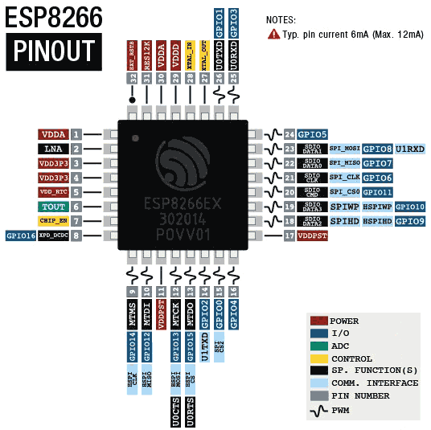
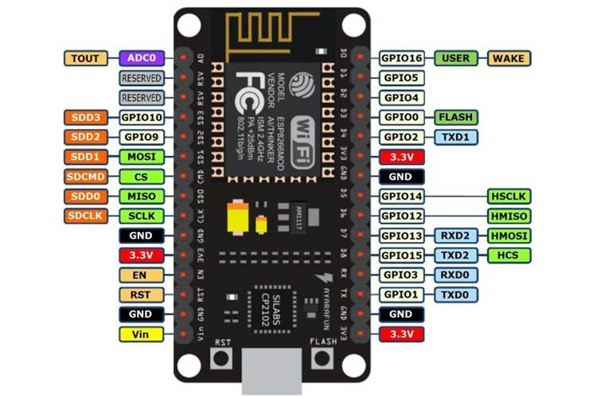

# 5-Day ESP8266 (NodeMCU) Workshop
## Hardware Checklist (Per Team)
- NodeMCU ESP8266 (V3 Lolin/Amica): The main controller.
- Micro USB Cable: CRITICAL: Must be a Data Sync cable. Many cheap cables are "Charge Only" and will not work.
- Breadboard: For connecting components without soldering.
- Jumper Wires: Female-to-Female (M-M).
- LEDs: Red & Green.
- Push Button: Tactile switch.
- IR Proximity Sensor: For obstacle detection.
- DHT11 Sensor: For Temperature & Humidity.
- SG90 Servo Motor: For mechanical movement.

## GETTING STARTED: The Setup Phase

### Technical Context
The ESP8266 uses a UART-to-USB bridge chip to talk to your PC. If you don't install the driver, your computer sees it as "Unknown Device".
### Understanding the Hardware: Chip vs. Board
Before writing code, it is essential to understand the distinction between the microcontroller chip and the development board.

1. The Chip: ESP8266EX
The metal-shielded square on the board is the ESP8266EX.
- Architecture: Tensilica L106 32-bit RISC processor.
- Clock Speed: 80 MHz (overclockable to 160 MHz).
- Connectivity: Integrated Wi-Fi radio (802.11 b/g/n).
- Logic Voltage: Strictly 3.3V. Applying 5V directly to the chip's pins will destroy it.
2. The Board: NodeMCU V3
Since the chip is too small to handle easily, it is mounted on the NodeMCU development board, which provides:
- Voltage Regulator (AMS1117): Converts the 5V from your USB cable down to the safe 3.3V required by the chip.
- USB-to-Serial Converter (CP2102): Translates USB signals from your computer into Serial (UART) data the chip can understand.
- Flash & Reset Circuitry: Allows the Arduino IDE to automatically reset the board and upload code without requiring you to manually hold buttons.
- Pin Headers: Breaks out the General Purpose Input/Output (GPIO) pins for easy breadboarding.

### ESP8266EX IC

### ESP8266 GPIO Diagram

### Step 1: Install Arduino IDE
Download and install Arduino IDE 2.x (modern) or 1.8.19 (classic/stable) from arduino.cc.

### Step 2: Install CP210x Drivers (The Bridge)
- Plug the NodeMCU into your PC.  
- Download and install the CP210x Driver from Silicon Labs.  
- Verify: Open Device Manager (Windows) -> Ports (COM & LPT). You should see "Silicon Labs CP210x USB to UART Bridge" on a COM port (e.g., COM3).

### Step 3: Install ESP8266 Board Package
- Open Arduino IDE.  
- Go to File > Preferences.  
- In "Additional Boards Manager URLs", paste: http://arduino.esp8266.com/stable/package_esp8266com_index.json

- Go to Tools > Board > Boards Manager.  
- Search esp8266 and click Install (by ESP8266 Community).

### Step 4: Final Config
- Board: Tools > Board > ESP8266 Boards > NodeMCU 1.0 (ESP-12E Module).  
- Port: Tools > Port > Select your COM port.  
- Upload Speed: 115200.
