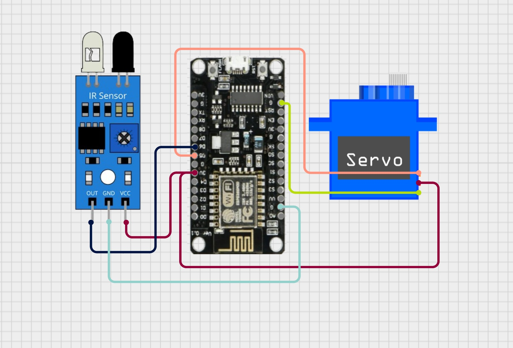

# Experiment 2: The Automated Barrier (Servo + IR)

## Short Description
You will create an automated parking gate. An IR sensor will detect the presence of a "car" (your hand), and the code will trigger a Servo motor to rotate 90 degrees to open the gate.

## Expected Outcome
Placing your hand near the sensor opens the gate (servo moves). Removing your hand causes the gate to close automatically after 3 seconds.

## Concept
PWM (Pulse Width Modulation) for motors and Digital Sensors.

## Wiring

### Servo (SG90)
- Brown -> GND  
- Red -> 3V3 (Use 3.3V pin).  
- Orange (Signal) -> GPIO 14 (Pin D5).

### IR Sensor
- VCC -> 3V3  
- GND -> GND  
- OUT -> GPIO 12 (Pin D6)

## Circuit Diagram


## The Code

```cpp
#include <Servo.h> 

Servo myGate;       // Create a servo object
const int irPin = 12;     // GPIO 12 (D6)
const int servoPin = 14;  // GPIO 14 (D5)

void setup() {
  Serial.begin(9600);
  
  // Attach servo to GPIO 14. 
  myGate.attach(servoPin); 
  myGate.write(0); // Start closed
  
  pinMode(irPin, INPUT);
}

void loop() {
  // IR Sensors usually output LOW (0V) when they detect an object
  if (digitalRead(irPin) == LOW) {
    Serial.println("Vehicle Detected! Opening Gate.");
    myGate.write(90);  // Open to 90 degrees
    delay(3000);       // Wait for car to pass
  } else {
    myGate.write(0);   // Close Gate
  }
  delay(100); // Small stability delay
}
```

## Result & Analysis

### Result
When you place your hand in front of the IR sensor, the Servo motor rotates 90 degrees. When you remove your hand, it rotates back to 0 degrees after 3 seconds.

### Reason
The IR sensor reflects infrared light. When an object is close, the reflection triggers the sensor's comparator to pull the Output pin LOW (0V). The code detects this LOW signal on GPIO 12 and sends a PWM signal to GPIO 14 to rotate the servo.