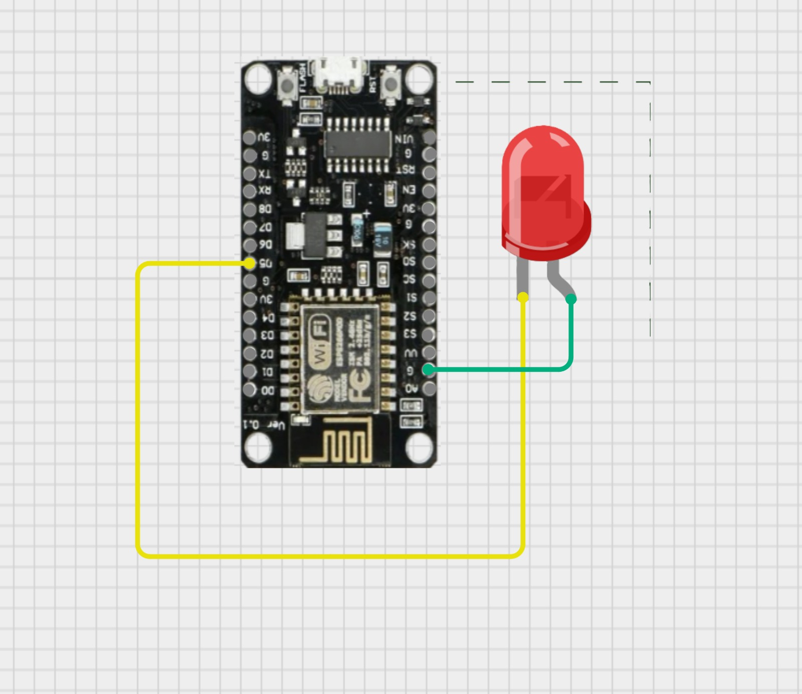

# The Web Controller

## Short Description
You will turn your ESP8266 into a mini-website host. By uploading HTML code to the board, you can create a control panel accessible from any browser on the same network.

## Expected Outcome
Visiting the ESP8266's IP address on your phone shows a webpage with "ON" and "OFF" buttons. Clicking them controls the real LED on your breadboard.

## Concept
Hosting a website (HTML) on the chip itself.

## Circuit Diagram

LED on GPIO 14 (Pin D5).

## The Code
```cpp
#include <ESP8266WiFi.h>
#include <ESP8266WebServer.h>

const char* ssid = "YOUR_WIFI_NAME";
const char* password = "YOUR_WIFI_PASS";

ESP8266WebServer server(80); // Port 80 is the default HTTP port
const int ledPin = 5; // GPIO 5 (D1)

// HTML Code stored in a String (Simple method)
String htmlPage = "<h1>Control Room</h1>"
                  "<p><a href=\"/on\"><button style=\"background:green; color:white; font-size:20px; padding:10px;\">TURN ON</button></a></p>"
                  "<p><a href=\"/off\"><button style=\"background:red; color:white; font-size:20px; padding:10px;\">TURN OFF</button></a></p>";

void handleRoot() {
  server.send(200, "text/html", htmlPage); // Send HTML to browser
}

void handleOn() {
  digitalWrite(ledPin, HIGH);
  server.send(200, "text/html", "<h1>Light ON</h1> <a href='/'>Back</a>");
}

void handleOff() {
  digitalWrite(ledPin, LOW);
  server.send(200, "text/html", "<h1>Light OFF</h1> <a href='/'>Back</a>");
}

void setup() {
  Serial.begin(115200);
  pinMode(ledPin, OUTPUT);
  
  WiFi.begin(ssid, password);
  Serial.print("Connecting");
  while (WiFi.status() != WL_CONNECTED) {
    delay(500);
    Serial.print(".");
  }
  
  Serial.println("\nConnected!");
  Serial.print("Go to this URL: http://");
  Serial.println(WiFi.localIP());

  server.on("/", handleRoot);
  server.on("/on", handleOn);
  server.on("/off", handleOff);
  
  server.begin();
}

void loop() {
  server.handleClient(); // Listen for incoming browser requests
}
```
## Result & Analysis

### Result
When you visit the IP address shown in Serial Monitor on your phone, you see two buttons. Clicking "TURN ON" lights up the LED.

### Reason
The ESP8266 runs a lightweight HTTP server. When your browser requests `http://<IP>/on`, the handleOn() function triggers, setting GPIO 5 HIGH.