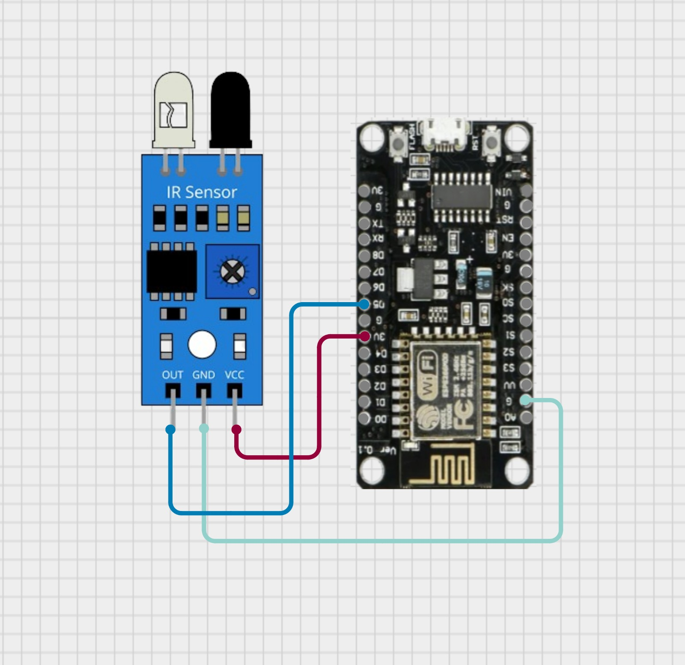

# Experiment 9: The Telegram Intruder Bot

## Goal
Real-time push notifications on your phone using Telegram's Secure API.

## Short Description
You will build a home security bot. Using the Telegram API, your ESP8266 will act as a "Chat Bot" that messages you directly on the Telegram app whenever it detects an intruder. 

## Expected Outcome
Triggering the motion sensor sends a "WARNING" message to your phone's Telegram app within seconds.

## Concept
1. HTTPS: Telegram requires a Secure Socket Layer (SSL).
2. API: We use the Telegram Bot API URL format: https://api.telegram.org/bot"TOKEN"/sendMessage.

## Setup
1.	Open Telegram -> Search "BotFather" -> /newbot -> Get Token.
2.	Search "IDBot" -> Get Chat ID.

## Circuit Diagram

IR Sensor Signal -> GPIO 14 (Pin D5).

## The Code
```cpp
#include <ESP8266WiFi.h>
#include <WiFiClientSecure.h> // Required for HTTPS

const char* ssid = "YOUR_WIFI";
const char* password = "YOUR_PASS";

// Replace with your Bot Details
String botToken = "123456789:ABCDefGhiJklMnoPqrStuVwxyz";
String chatID = "12345678";

const int irPin = 4; // GPIO 4 (D2)
WiFiClientSecure client; 

void setup() {
  Serial.begin(115200);
  pinMode(irPin, INPUT);
  
  WiFi.begin(ssid, password);
  while (WiFi.status() != WL_CONNECTED) { delay(500); Serial.print("."); }
  
  // TECHNICAL CRITICAL STEP:
  // Telegram uses SSL certificates. The ESP8266 doesn't have enough memory 
  // to store all root certificates. We use setInsecure() to trust the server blindly.
  client.setInsecure();
  Serial.println("\nSystem Armed.");
}

void loop() {
  if (digitalRead(irPin) == LOW) { // Intruder detected
    Serial.println("Motion! Sending Alert...");
    
    // We replace spaces with '+' because URL cannot contain spaces
    sendTelegram("WARNING_INTRUDER_DETECTED_WARNING");
    
    delay(10000); // 10 second cool-down
  }
}

void sendTelegram(String msg) {
  if (client.connect("api.telegram.org", 443)) { // Port 443 is for HTTPS
    String url = "/bot" + botToken + "/sendMessage?chat_id=" + chatID + "&text=" + msg;
    
    // Send HTTP GET Request
    client.print(String("GET ") + url + " HTTP/1.1\r\n" +
                 "Host: api.telegram.org\r\n" + 
                 "Connection: close\r\n\r\n");
  } else {
    Serial.println("Connection Failed");
  }
}

```

## Result & Analysis
### Result
When the IR sensor detects motion, you instantly get a message on your Telegram App: "WARNING_INTRUDER_DETECTED_WARNING".
### Reason
This experiment demonstrates HTTPS (Secure) communication. Unlike HTTP (Day 2/3), this requires an SSL handshake. We use client.setInsecure() to bypass certificate validation, allowing the low-power ESP8266 to talk to the encrypted Telegram server.
